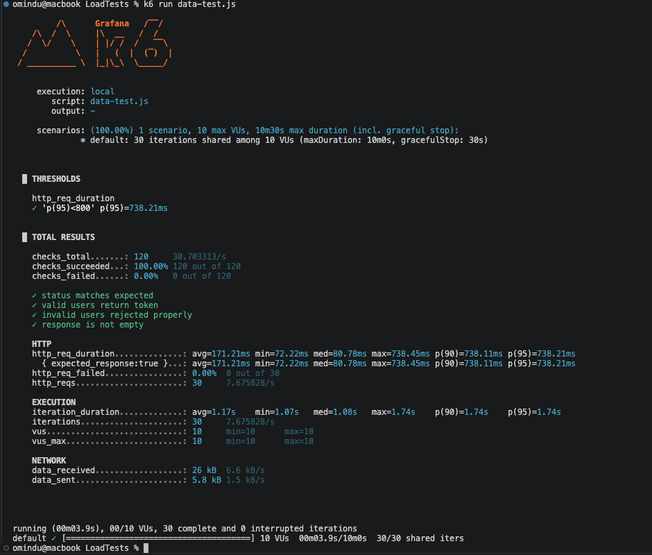

# SE3112 Take-Home Assessment - Testing Implementation

## Group Members and Responsibilities

### Student 1 - IT23645684 - V.N. Jayasinghe
Description: Unit/Component Testing (Playwright), parameterized test scenarios.

### Student 2 - IT23575608 - H.W. Ranwala
Description: Unit/Component Testing (PLaywright), fixtures and mocking for component/service behavior.

### Student 3 - IT23750210 - K.H.G.A. Udaneth
Description: Load/Performance Testing (K6), spike and stress test configuration/execution.

### Student 4 - IT23575776 - M.S.A.O. Kumara
Description: Load/Performance Testing (K6), data-driven login payload testing using user dataset.

## Test Result Evidence

Student 2 result images:

<table>
   <tr>
      <td></td>
      <td></td>
   </tr>
</table>

Student 3 result images:

<table>
   <tr>
      <td></td>
      <td></td>
   </tr>
</table>

Student 4 result image:

